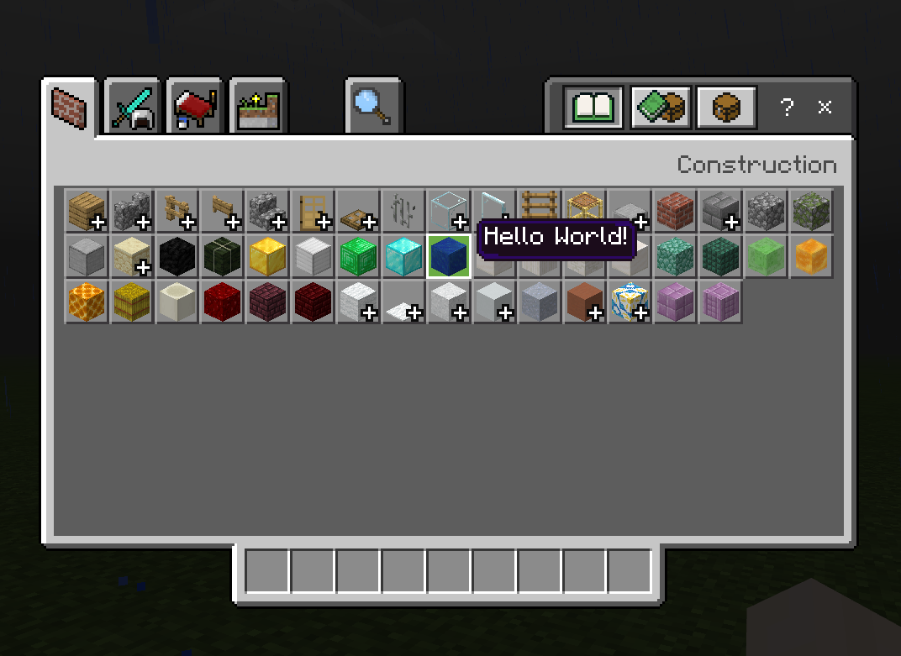

# 2.3 - Intro to Hooking

To begin creating code to interact with Minecraft, a concept called `Hooking` can be used. Hooking allows code to be injected before or after existing functions, as well as being able to get the parameters passed to the function, and modify what is passed to the actual function.

## Hooks in Zenova

First of all, ZenovaAPI provides two types of Hooks:
- `Zenova_Hook` - used to hook non-virtual functions
- `Zenova_VHook` - used to hook virtual functions in classes

To begin this guide will show you how to modify the behaviour of hovering over items. Firstly add an include to the item header as shown below:
```h
#include "Minecraft/Items/Item.h
```

You can open up the header file by holding down `Ctrl` and clicking on the include. Inside you can see all of the virtual functions that are used by the Item class. Specifically to modify the behaviour for hovering over items, you would hook `appendFormattedHovertext`.

Navigate to `appendFormattedHoverText` in `Item.h`
```h
virtual void appendFormattedHovertext(const ItemStackBase&, Level&, std::string&, const bool) const;
```


## Defining a hook
1. Firstly heres how to define a "trampoline", a trampoline is a way to call the original code inside of the hook. Here is the trampoline used for `appendFormattedHoverText`:
```h
inline static void (*_appendFormattedHoverText)(Item*, const ItemStackBase&, Level&, std::string&, const bool);
```

<br />

2. It firstly takes in a pointer to the class it is from, as well as it is followed by all the parameters of the original function. Next define the actual hook, it takes in all the same parameters as the trampoline function but with parameter names so that they can be referenced.
```h
static void appendFormattedHoverText(Item* item, const ItemStackBase& itemBase, Level& level, std::string& hoverText, const bool showCategory) 
{
    // Call the original piece of code so it still behaves like normal
    _appendFormattedHoverText(item, itemBase, level, hoverText, showCategory);

    // Print to console to test if it is working
    Zenova_Info("Hook called!");
}
```

<br />

3. Build the project and open up a world and hover over items in the inventory. If everything has gone right it should still work as normal, but the console should be flooded with messages! After you have finished close your Minecraft instance, and now in your hook remove the call to the trampoline, and set hoverText to a string
```h
static void appendFormattedHoverText(Item* item, const ItemStackBase& itemBase, Level& level, std::string& hoverText, const bool showCategory) 
{
    hoverText = "Hello World!";
}
```

<br />


4. Re-build the project and now observe how the text when hovering, is now always "Hello World". 
