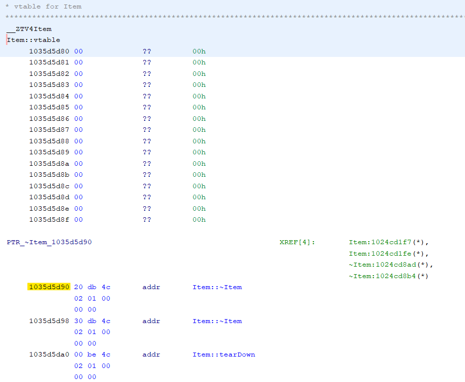

# 3.2 - Generating Headers

## Extracting Vtable Order

1. To get started, locate the class you want to generate a header for inside of the `Mac Education Client` in the `SymbolTree` window and select the `vtable`. 

    

 

2. Next locate the first function address in the Vtable, and copy it to a notepad file. The image below shows the first address highlighted in yellow (`1035d5d90`)

    

 

3. Next locate the last function address in the Vtable by scrolling downwards and again copy it to a notepad file. The image below shows the last address highlighted in yellow (`1035d60b0`)

    

 

4. In the `ScriptManager` window in Ghidra, open the `Bedrock` category and run the script `ExtractVtableOrder.py`. Enter all details it prompts you for.

## Generating C++ Header

1. To get started open up your Ghidra Project for the `Windows Server`. Next open the `ScriptManager` and run `GenerateHeader.py` in the `Bedrock` category.

 

2. After the script has finished running it will output a `header file` and a `symbol map` for your class to `%userprofile%/Desktop/HeaderOut`.

## Common Issues
- ### Failed to find: '...'
    This occurs when the script is unable to locate the same function from the dumped Vtable in the BDS, this is often because the script has failed to parse a type with generic types. To solve this issue manually complete these functions by hand. 
    
- ### Unknown pure virtual function
    This occurs because the script is unable to work with pure virtual functions, to solve this issue manually complete these functions by hand.